# k8s环境下的istio + consul


## 架构介绍

右侧是istio原生服务网格，部署在k8s中。

左侧的spring cloud的网络，consul作为spring cloud的服务注册中心，也存储了K8s中服务发现的数据。consul通过 自身的service sync功能，从k8s同步服务注册到自身；同时pilot通过adapt机制从consul从拉取服务配置供原生的服务网格注册服务。

注：官网consul的架构在docker-compose 环境下需要使用registrator来注册docker服务到consul，试验后发现，registrator在K8s环境中，由于使用了cni网络。无法从container中获取ip地址，详细可以看下方的问题记录。


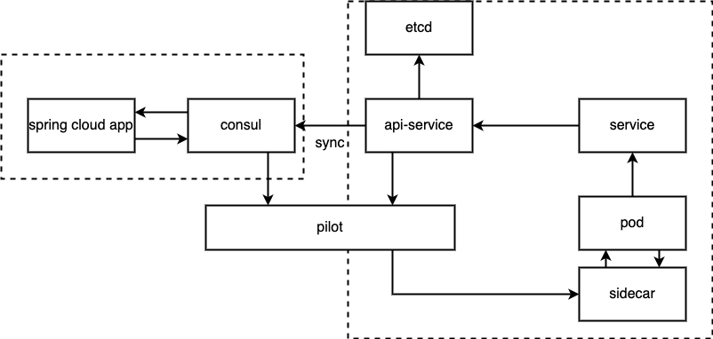

## 部署流程


1. 修改istiod配置，接入consul

修改istiod默认的参数为如下、增加Consul的相关配置，这样consul中的服务就能够接入istio。这里记住无法只使用Consul，必须同时开启Kubernetes

```yaml
    - discovery
            ...
            - '--registries=Consul,Kubernetes'
            - '--consulserverURL=http://consul-ui.springcloud:80'
```


2. 安装并启动consul 并同步k8s service

   consul安装和配置如下

   https://www.consul.io/docs/k8s/service-sync

   安装完毕后、会发现k8s的服务都已经被同步到 。可以在service中设置annotations的key 为“consul.hashicorp.com/service-name” 等 提供具体的注册服务

   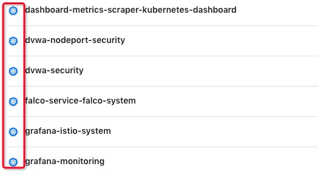
   
3. 尝试创建demo，手动实现注册consul、这个的sc1是手动注册的

   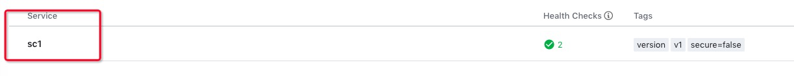


## demo验证

访问流程图如下


   ```shell
   cd k8s 
   # 部署3个应用的deployment
   kubectl apply -f deployment.yaml
   # 部署3个svc
   kubectl apply -f svc.yaml
   # 创建istio路由
   kubectl apply -f rule.yaml
   ```

2. 访问http://{istio-gateway}/hello

   返回I am sc1&&I am istio-client&&I am sc0, 表示网络已通

   

3. 打开kiali查看分布式追踪

   Istio-ingress-gateway到sc0 是正确的，然后后面断了，因为sc0的应用没有sidecar，无法上报状态

   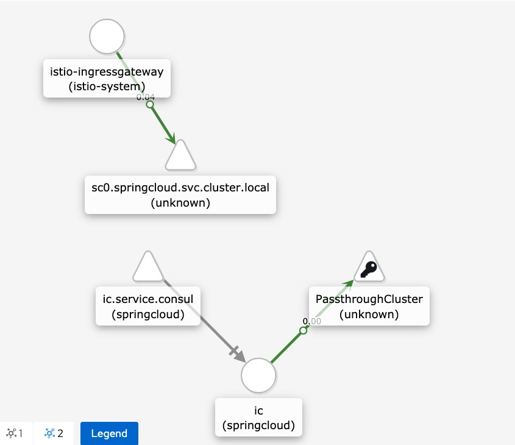


## 结论：

1. spring cloud应用 -> istio 应用

通过consul方式获取注册应用的ip进行访问。 可行


2. istio应用 -> sping cloud应用

直接访问spring cloud在consul中注册的服务名, 需要给pod设置consul 的dns服务器提供解析。可行


## 问题记录

#### 1.使用registrator在k8s中注册的服务没有ip地址

K8s中运行注册的服务缺少Address

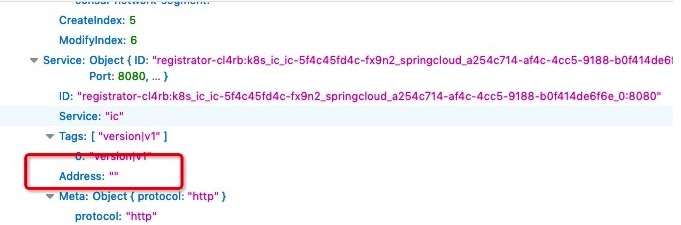

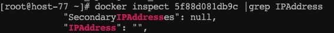

docker 运行存在Address

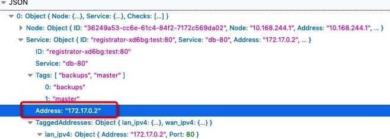

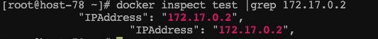

获取ip的源码，如果使用了netWorkmode，会获取相同共享网络下的另一个containers，获取它的ip。

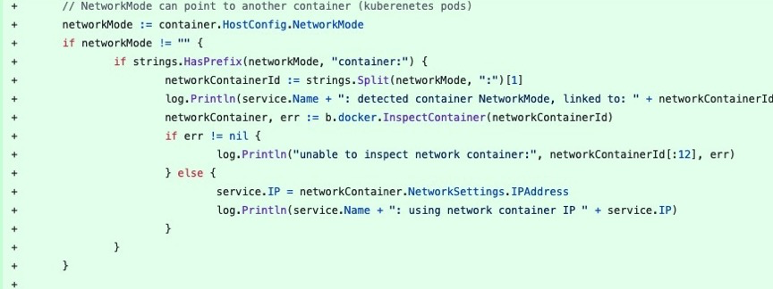

还是没有ip

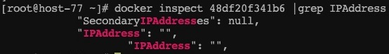


所以放弃放弃用 registrator

发现consul支持和k8s同步、使用改方法为k8s中的pod注册服务到consul
https://www.consul.io/docs/k8s/connect#installation-and-configuration


#### 域错误
还是保持默认的service.consul域，无法转成kubernes的域

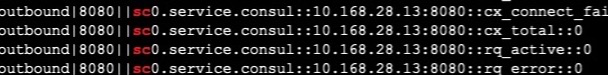


解决方案：相同namespace中访问好像没有影响，如果是跨域访问还是存在问题。看看哪里配置可以修改域

#### istio 访问 spring-cloud无法识别服务名

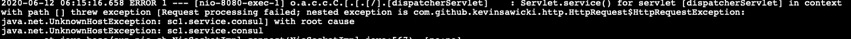


虽然istio应用注入sidecar以后，所有流量均走envoy过。但是之前必须得先走一次dns解析才行，所以就失败了

解决方案1：需要创建一个同名的service(不可行)

但是最后会在sidecar的envoy中出现2个svc共存的情况

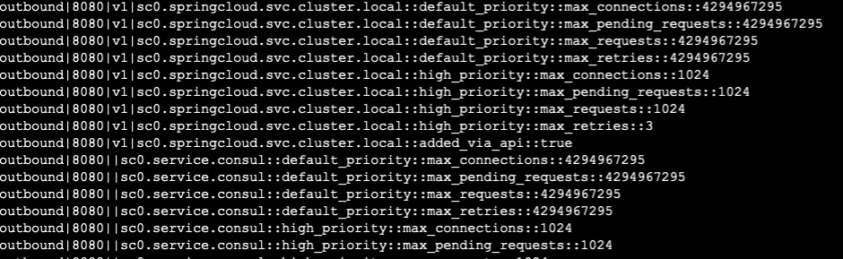

解决方案2：尝试使用consul自身的dns服务（可行）

需要在pod中配置额外的consul dns服务

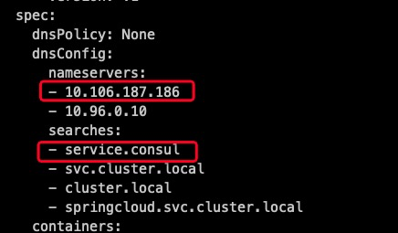